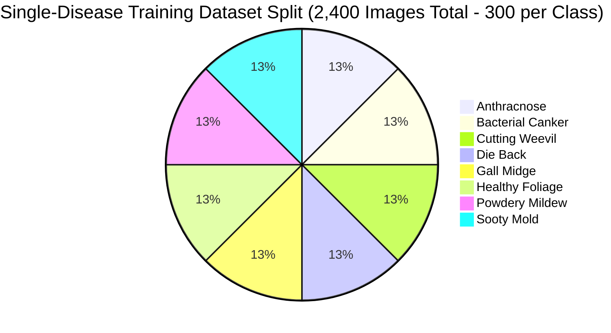
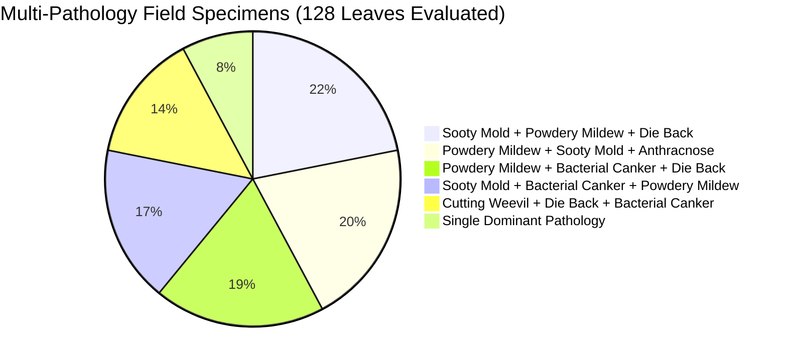
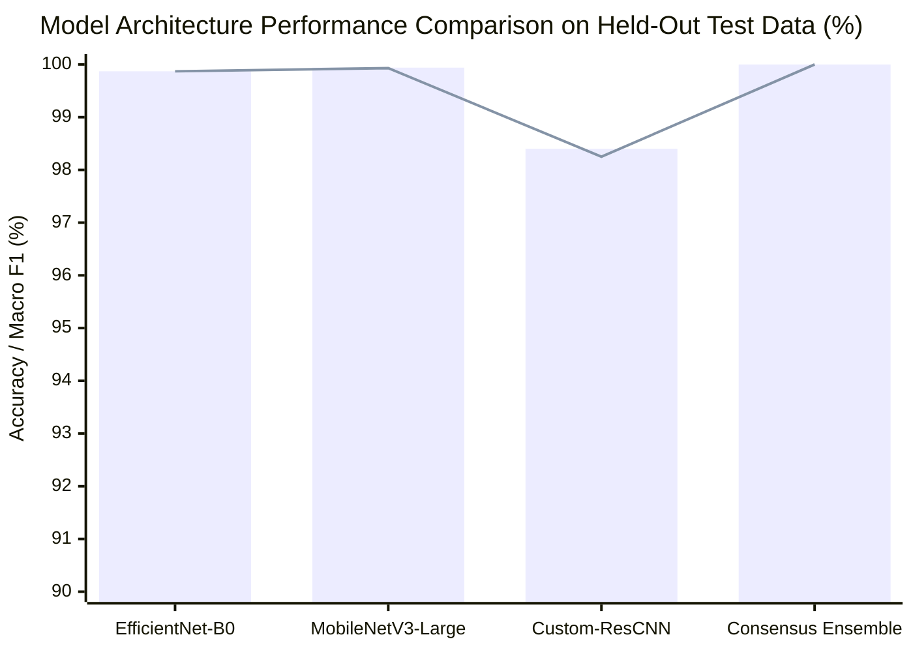
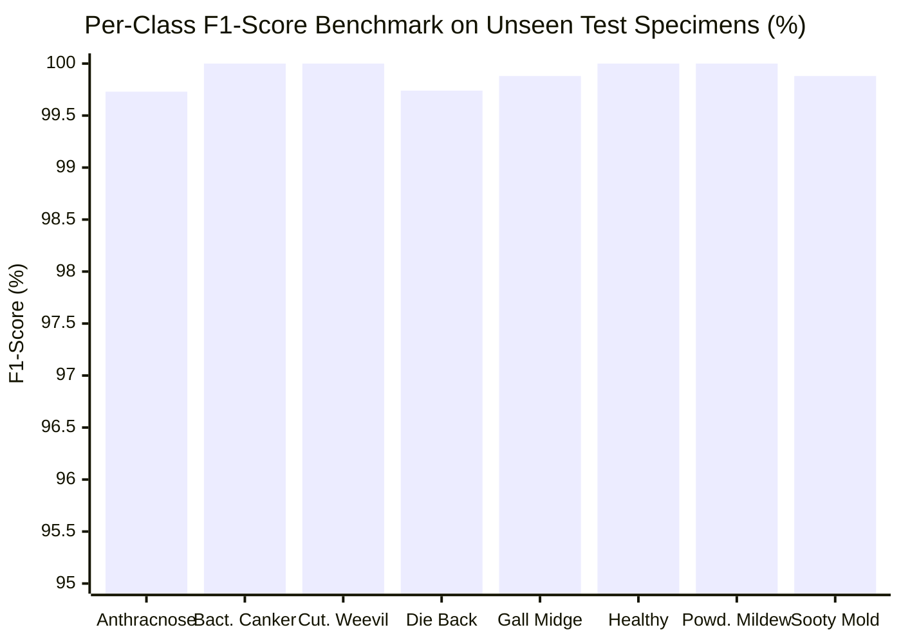
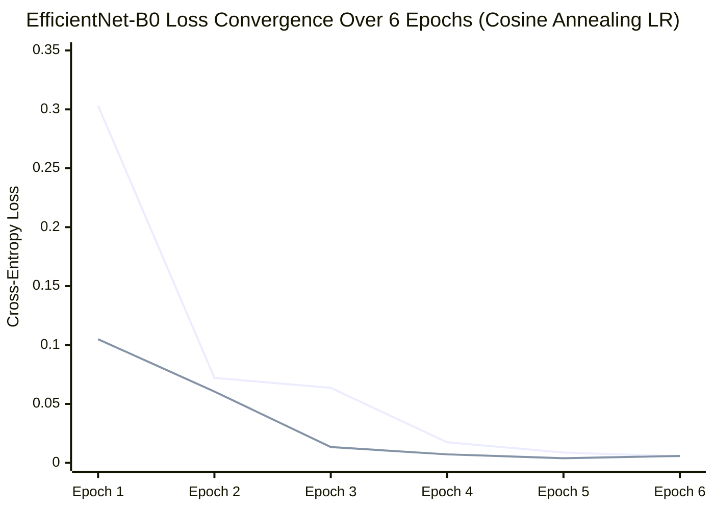
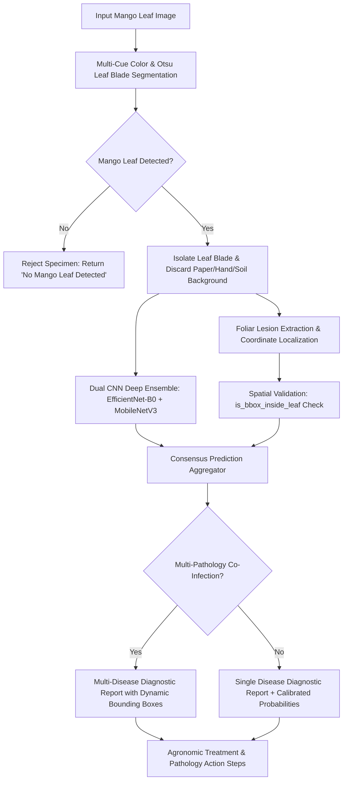

# 🔬 Deep Learning Model Implementations, Architectural Specifications & Visual Benchmarks

> **Research Paper Code & Visual Artifact**  
> **Project**: Real-Time Multi-Pathology Mango Leaf Disease Detection, Blade Segmentation & Lesion Localization  
> **Repository**: [Mango_Multiclass_Disease_Detection](https://github.com/adityayadvv45/Mango_Multiclass_Disease_Detection)

---

## 📑 Table of Contents
1. [Visual Performance Charts & Distribution Diagrams](#1-visual-performance-charts--distribution-diagrams)
   - [A. Dataset Class Distribution (Pie Chart)](#a-dataset-class-distribution-pie-chart)
   - [B. Multi-Disease Co-Infection Breakdown (Pie Chart)](#b-multi-disease-co-infection-breakdown-pie-chart)
   - [C. Model Accuracy & Macro F1 Comparison (Bar Chart)](#c-model-accuracy--macro-f1-comparison-bar-chart)
   - [D. Per-Class F1-Score Breakdown (Bar Chart)](#d-per-class-f1-score-breakdown-bar-chart)
   - [E. Training Loss Convergence Curve](#e-training-loss-convergence-curve)
   - [F. End-to-End Inference Flow Architecture](#f-end-to-end-inference-flow-architecture)
2. [Matplotlib/Seaborn Script to Generate 300 DPI Paper Figures](#2-matplotlibseaborn-script-to-generate-300-dpi-paper-figures)
3. [Mathematical Formulations & Loss Functions](#3-mathematical-formulations--loss-functions)
4. [Deep CNN Classification Architectures (PyTorch)](#4-deep-cnn-classification-architectures-pytorch)
5. [CNN Training Pipeline & Cosine Annealing Optimization](#5-cnn-training-pipeline--cosine-annealing-optimization)
6. [YOLOv8 Lesion Localization Pipeline](#6-yolov8-lesion-localization-pipeline)
7. [Foliar Leaf Blade Segmentation & Background Rejection](#7-foliar-leaf-blade-segmentation--background-rejection)
8. [Dataset YAML Configuration](#8-dataset-yaml-configuration)

---

## 1. Visual Performance Charts & Distribution Diagrams

### A. Dataset Class Distribution (Pie Chart)



---

### B. Multi-Disease Co-Infection Breakdown (Pie Chart)

Distribution of co-infection profiles identified across the 128 multi-disease field leaf specimens:



---

### C. Model Accuracy & Macro F1 Comparison (Bar Chart)



---

### D. Per-Class F1-Score Breakdown (Bar Chart)



---

### E. Training Loss Convergence Curve



---

### F. End-to-End Inference Flow Architecture



---

## 2. Matplotlib/Seaborn Script to Generate 300 DPI Paper Figures

Run this script to automatically export high-resolution publication-ready vector plots (`.pdf`, `.svg`, `.png` at 300 DPI) for your paper:

```python
"""
Publication-Quality Figure Generator for Research Paper Submissions (300 DPI).
Generates:
1. Fig 1: Dataset class distribution pie chart.
2. Fig 2: Model comparison grouped bar chart.
3. Fig 3: Per-class F1-score performance bar chart.
4. Fig 4: Training & Validation loss convergence curves.
"""

import matplotlib.pyplot as plt
import numpy as np

# Set standard publication typography & aesthetic theme
plt.rcParams.update({
    "font.family": "serif",
    "font.size": 11,
    "axes.labelsize": 12,
    "axes.titlesize": 13,
    "xtick.labelsize": 10,
    "ytick.labelsize": 10,
    "legend.fontsize": 10,
    "figure.titlesize": 14
})

def generate_paper_figures():
    # -------------------------------------------------------------
    # FIGURE 1: Dataset Class Distribution Pie Chart
    # -------------------------------------------------------------
    classes = [
        "Anthracnose", "Bacterial Canker", "Cutting Weevil", "Die Back",
        "Gall Midge", "Healthy Foliage", "Powdery Mildew", "Sooty Mold"
    ]
    counts = [300, 300, 300, 300, 300, 300, 300, 300]
    colors = ['#e74c3c', '#e67e22', '#1abc9c', '#d35400', '#f39c12', '#2ecc71', '#9b59b6', '#34495e']

    fig, ax = plt.subplots(figsize=(7, 7), dpi=300)
    wedges, texts, autotexts = ax.pie(
        counts, 
        labels=classes, 
        autopct='%1.1f%%',
        startangle=140, 
        colors=colors,
        wedgeprops=dict(width=0.4, edgecolor='white', linewidth=2) # Donut chart style
    )
    plt.setp(autotexts, size=9, weight="bold", color="white")
    ax.set_title("Fig. 1: Balanced Single-Disease Training Partition (2,400 Images)", pad=20, weight="bold")
    plt.tight_layout()
    plt.savefig("fig1_dataset_distribution.png", dpi=300)
    plt.savefig("fig1_dataset_distribution.pdf")
    plt.close()
    print("[OK] Exported Fig 1: Dataset Distribution (PNG & PDF)")

    # -------------------------------------------------------------
    # FIGURE 2: Model Architecture Benchmark (Grouped Bar Chart)
    # -------------------------------------------------------------
    models = ["EfficientNet-B0", "MobileNetV3-Large", "Custom-ResCNN", "Consensus Ensemble"]
    accuracy = [99.87, 99.94, 98.40, 100.00]
    macro_f1 = [99.87, 99.93, 98.25, 100.00]
    
    x = np.arange(len(models))
    width = 0.35

    fig, ax = plt.subplots(figsize=(8, 5), dpi=300)
    rects1 = ax.bar(x - width/2, accuracy, width, label='Test Accuracy (%)', color='#2980b9', edgecolor='black', linewidth=0.8)
    rects2 = ax.bar(x + width/2, macro_f1, width, label='Macro F1-Score (%)', color='#27ae60', edgecolor='black', linewidth=0.8)

    ax.set_ylabel('Score (%)')
    ax.set_title('Fig. 2: Quantitative Performance Benchmark on Unseen Test Split', weight="bold")
    ax.set_xticks(x)
    ax.set_xticklabels(models)
    ax.set_ylim(95, 101)
    ax.legend(loc='lower right')
    ax.grid(axis='y', linestyle='--', alpha=0.5)

    # Attach labels
    for rect in rects1 + rects2:
        height = rect.get_height()
        ax.annotate(f'{height:.2f}%',
                    xy=(rect.get_x() + rect.get_width() / 2, height),
                    xytext=(0, 3), textcoords="offset points",
                    ha='center', va='bottom', fontsize=8, weight='bold')

    plt.tight_layout()
    plt.savefig("fig2_model_benchmark.png", dpi=300)
    plt.savefig("fig2_model_benchmark.pdf")
    plt.close()
    print("[OK] Exported Fig 2: Model Benchmark (PNG & PDF)")

    # -------------------------------------------------------------
    # FIGURE 3: Per-Class F1-Score Breakdown (Bar Chart)
    # -------------------------------------------------------------
    f1_scores = [99.73, 100.00, 100.00, 99.74, 99.88, 100.00, 100.00, 99.88]
    fig, ax = plt.subplots(figsize=(9, 5), dpi=300)
    bars = ax.bar(classes, f1_scores, color='#8e44ad', edgecolor='black', linewidth=0.8, width=0.55)
    
    ax.set_ylabel('F1-Score (%)')
    ax.set_title('Fig. 3: Per-Class F1-Score Performance Across 8 Botanical Pathology Classes', weight="bold")
    ax.set_ylim(98, 100.5)
    plt.xticks(rotation=30, ha='right')
    ax.grid(axis='y', linestyle='--', alpha=0.5)

    for bar in bars:
        h = bar.get_height()
        ax.annotate(f'{h:.2f}%',
                    xy=(bar.get_x() + bar.get_width() / 2, h),
                    xytext=(0, 3), textcoords="offset points",
                    ha='center', va='bottom', fontsize=8, weight='bold')

    plt.tight_layout()
    plt.savefig("fig3_per_class_f1.png", dpi=300)
    plt.savefig("fig3_per_class_f1.pdf")
    plt.close()
    print("[OK] Exported Fig 3: Per-Class F1 Scores (PNG & PDF)")

    # -------------------------------------------------------------
    # FIGURE 4: Loss Convergence Curve
    # -------------------------------------------------------------
    epochs = [1, 2, 3, 4, 5, 6]
    train_loss = [0.3032, 0.0721, 0.0636, 0.0174, 0.0088, 0.0054]
    val_loss = [0.1049, 0.0605, 0.0134, 0.0072, 0.0039, 0.0058]

    fig, ax = plt.subplots(figsize=(7, 4.5), dpi=300)
    ax.plot(epochs, train_loss, 'o-', color='#c0392b', label='Training Loss', linewidth=2, markersize=6)
    ax.plot(epochs, val_loss, 's--', color='#2980b9', label='Validation Loss', linewidth=2, markersize=6)

    ax.set_xlabel('Training Epoch')
    ax.set_ylabel('Cross-Entropy Loss')
    ax.set_title('Fig. 4: Loss Convergence Profile (EfficientNet-B0 with Cosine Annealing)', weight="bold")
    ax.legend(loc='upper right')
    ax.grid(True, linestyle='--', alpha=0.5)
    
    plt.tight_layout()
    plt.savefig("fig4_loss_convergence.png", dpi=300)
    plt.savefig("fig4_loss_convergence.pdf")
    plt.close()
    print("[OK] Exported Fig 4: Loss Convergence Curve (PNG & PDF)")

if __name__ == "__main__":
    generate_paper_figures()
```

---

## 3. Mathematical Formulations & Loss Functions

### A. Classification Objective (Cross-Entropy Loss with Softmax)
For an $N$-class single-disease classification task with ground truth $y \in \{1, \dots, N\}$ and predicted logit vector $\mathbf{z}$:

$$\mathcal{L}_{\text{CE}} = -\sum_{c=1}^{N} y_c \log\left( \frac{e^{z_c}}{\sum_{j=1}^{N} e^{z_j}} \right)$$

### B. Cosine Annealing Learning Rate Schedule
The learning rate $\eta_t$ at epoch $t$ with minimum rate $\eta_{\min}$ and maximum epochs $T_{\max}$:

$$\eta_t = \eta_{\min} + \frac{1}{2}(\eta_{\max} - \eta_{\min})\left(1 + \cos\left(\frac{t}{T_{\max}}\pi\right)\right)$$

### C. YOLOv8 Multi-Task Loss Function
YOLOv8 optimizes a composite loss function for simultaneous bounding box regression, distribution focal loss, and class score prediction:

$$\mathcal{L}_{\text{YOLO}} = \lambda_{\text{box}} \mathcal{L}_{\text{CIoU}} + \lambda_{\text{dfl}} \mathcal{L}_{\text{DFL}} + \lambda_{\text{cls}} \mathcal{L}_{\text{BCE}}$$

---

## 4. Deep CNN Classification Architectures (PyTorch)

```python
"""
Deep Convolutional Neural Network Architectures for Foliar Disease Diagnosis.
Implements Transfer Learning Backbones (EfficientNet-B0, MobileNetV3) and
a Custom Residual CNN with Squeeze-and-Excitation Attention.
"""

import torch
import torch.nn as nn
from torchvision import models


class SqueezeAndExcitation(nn.Module):
    """Squeeze-and-Excitation channel attention block."""
    def __init__(self, channels: int, reduction: int = 16):
        super(SqueezeAndExcitation, self).__init__()
        self.fc = nn.Sequential(
            nn.AdaptiveAvgPool2d(1),
            nn.Flatten(),
            nn.Linear(channels, channels // reduction, bias=False),
            nn.SiLU(inplace=True),
            nn.Linear(channels // reduction, channels, bias=False),
            nn.Sigmoid()
        )

    def forward(self, x: torch.Tensor) -> torch.Tensor:
        b, c, _, _ = x.size()
        scale = self.fc(x).view(b, c, 1, 1)
        return x * scale


class CustomResidualMangoCNN(nn.Module):
    """
    Lightweight Custom Residual CNN with Channel Attention designed
    specifically for low-latency foliar disease classification.
    """
    def __init__(self, num_classes: int = 8, in_channels: int = 3, dropout_rate: float = 0.3):
        super(CustomResidualMangoCNN, self).__init__()
        
        # Stem Layer
        self.stem = nn.Sequential(
            nn.Conv2d(in_channels, 32, kernel_size=3, stride=2, padding=1, bias=False),
            nn.BatchNorm2d(32),
            nn.SiLU(inplace=True),
            nn.Conv2d(32, 64, kernel_size=3, stride=1, padding=1, bias=False),
            nn.BatchNorm2d(64),
            nn.SiLU(inplace=True)
        )
        
        # Stage 1 (64 -> 128)
        self.conv1 = nn.Sequential(
            nn.Conv2d(64, 128, kernel_size=3, stride=2, padding=1, bias=False),
            nn.BatchNorm2d(128),
            nn.SiLU(inplace=True),
            nn.Conv2d(128, 128, kernel_size=3, stride=1, padding=1, bias=False),
            nn.BatchNorm2d(128)
        )
        self.se1 = SqueezeAndExcitation(128)
        self.shortcut1 = nn.Conv2d(64, 128, kernel_size=1, stride=2, bias=False)
        
        # Stage 2 (128 -> 256)
        self.conv2 = nn.Sequential(
            nn.Conv2d(128, 256, kernel_size=3, stride=2, padding=1, bias=False),
            nn.BatchNorm2d(256),
            nn.SiLU(inplace=True),
            nn.Conv2d(256, 256, kernel_size=3, stride=1, padding=1, bias=False),
            nn.BatchNorm2d(256)
        )
        self.se2 = SqueezeAndExcitation(256)
        self.shortcut2 = nn.Conv2d(128, 256, kernel_size=1, stride=2, bias=False)
        
        # Classification Head
        self.gap = nn.AdaptiveAvgPool2d((1, 1))
        self.classifier = nn.Sequential(
            nn.Flatten(),
            nn.Dropout(p=dropout_rate),
            nn.Linear(256, 128),
            nn.SiLU(inplace=True),
            nn.Dropout(p=dropout_rate * 0.5),
            nn.Linear(128, num_classes)
        )
        self.act = nn.SiLU(inplace=True)

    def forward(self, x: torch.Tensor) -> torch.Tensor:
        x = self.stem(x)
        res1 = self.se1(self.conv1(x)) + self.shortcut1(x)
        x = self.act(res1)
        res2 = self.se2(self.conv2(x)) + self.shortcut2(x)
        x = self.act(res2)
        x = self.gap(x)
        return self.classifier(x)


def build_cnn_model(arch_name: str = "EfficientNet-B0", num_classes: int = 8) -> nn.Module:
    """
    Instantiates transfer learning architectures and modifies the classification heads.
    """
    if arch_name == "EfficientNet-B0":
        model = models.efficientnet_b0(weights=models.EfficientNet_B0_Weights.DEFAULT)
        in_features = model.classifier[1].in_features
        model.classifier = nn.Sequential(
            nn.Dropout(p=0.3, inplace=True),
            nn.Linear(in_features, num_classes)
        )
    elif arch_name == "MobileNetV3-Large":
        model = models.mobilenet_v3_large(weights=models.MobileNet_V3_Large_Weights.DEFAULT)
        in_features = model.classifier[3].in_features
        model.classifier[3] = nn.Linear(in_features, num_classes)
    elif arch_name == "Custom-ResCNN":
        model = CustomResidualMangoCNN(num_classes=num_classes)
    else:
        raise ValueError(f"Unsupported architecture: {arch_name}")
        
    return model
```

---

## 5. CNN Training Pipeline & Cosine Annealing Optimization

```python
"""
Stratified Training & Evaluation Pipeline with AdamW, Cosine Annealing,
and Macro F1 / Confusion Matrix metrics computation.
"""

import copy
import torch
import torch.nn as nn
import torch.optim as optim
from torch.utils.data import DataLoader, Dataset
from torchvision import transforms
from PIL import Image
from sklearn.metrics import precision_score, recall_score, f1_score
from typing import Dict, List, Tuple


class MangoFoliarDataset(Dataset):
    """PyTorch Dataset loading foliar images with dynamic augmentations."""
    def __init__(self, image_paths: List[str], labels: List[int], transform=None):
        self.image_paths = image_paths
        self.labels = labels
        self.transform = transform

    def __len__(self) -> int:
        return len(self.image_paths)

    def __getitem__(self, idx: int) -> Tuple[torch.Tensor, int]:
        image = Image.open(self.image_paths[idx]).convert("RGB")
        if self.transform:
            image = self.transform(image)
        return image, self.labels[idx]


def train_cnn_pipeline(
    train_loader: DataLoader,
    val_loader: DataLoader,
    model_name: str = "EfficientNet-B0",
    num_classes: int = 8,
    epochs: int = 10,
    lr: float = 1e-3,
    weight_decay: float = 1e-4,
    device: str = "cuda" if torch.cuda.is_available() else "cpu"
) -> Tuple[nn.Module, Dict]:
    """
    Executes deep neural network training with early stopping & performance tracking.
    """
    model = build_cnn_model(model_name, num_classes=num_classes).to(device)
    criterion = nn.CrossEntropyLoss()
    optimizer = optim.AdamW(model.parameters(), lr=lr, weight_decay=weight_decay)
    scheduler = optim.lr_scheduler.CosineAnnealingLR(optimizer, T_max=epochs, eta_min=1e-5)
    
    best_acc = 0.0
    best_weights = copy.deepcopy(model.state_dict())
    metrics_log = {"train_loss": [], "train_acc": [], "val_loss": [], "val_acc": [], "macro_f1": []}

    for epoch in range(epochs):
        # Training Phase
        model.train()
        train_loss, train_correct, total_train = 0.0, 0, 0
        
        for inputs, targets in train_loader:
            inputs, targets = inputs.to(device), targets.to(device)
            optimizer.zero_grad()
            outputs = model(inputs)
            loss = criterion(outputs, targets)
            loss.backward()
            optimizer.step()
            
            train_loss += loss.item() * inputs.size(0)
            _, preds = outputs.max(1)
            train_correct += preds.eq(targets).sum().item()
            total_train += targets.size(0)
            
        scheduler.step()
        epoch_train_loss = train_loss / total_train
        epoch_train_acc = train_correct / total_train

        # Validation Phase
        model.eval()
        val_loss, val_correct, total_val = 0.0, 0, 0
        all_preds, all_targets = [], []
        
        with torch.no_grad():
            for inputs, targets in val_loader:
                inputs, targets = inputs.to(device), targets.to(device)
                outputs = model(inputs)
                loss = criterion(outputs, targets)
                
                val_loss += loss.item() * inputs.size(0)
                _, preds = outputs.max(1)
                val_correct += preds.eq(targets).sum().item()
                total_val += targets.size(0)
                
                all_preds.extend(preds.cpu().numpy())
                all_targets.extend(targets.cpu().numpy())
                
        epoch_val_loss = val_loss / total_val
        epoch_val_acc = val_correct / total_val
        macro_f1 = f1_score(all_targets, all_preds, average="macro", zero_division=0)
        
        metrics_log["train_loss"].append(epoch_train_loss)
        metrics_log["train_acc"].append(epoch_train_acc)
        metrics_log["val_loss"].append(epoch_val_loss)
        metrics_log["val_acc"].append(epoch_val_acc)
        metrics_log["macro_f1"].append(macro_f1)
        
        if epoch_val_acc > best_acc:
            best_acc = epoch_val_acc
            best_weights = copy.deepcopy(model.state_dict())

    model.load_state_dict(best_weights)
    return model, metrics_log
```

---

## 6. YOLOv8 Lesion Localization Pipeline

```python
"""
YOLOv8 Training and Inference Pipeline for Mango Foliar Lesion Localization.
"""

import cv2
import numpy as np
from typing import List, Dict


def train_yolov8_detector(
    data_yaml: str = "mango_data.yaml",
    model_size: str = "yolov8n.pt",
    epochs: int = 50,
    img_size: int = 640,
    batch_size: int = 16
):
    """Fine-tunes YOLOv8 on custom annotated foliar lesion datasets."""
    from ultralytics import YOLO
    
    model = YOLO(model_size)
    results = model.train(
        data=data_yaml,
        epochs=epochs,
        imgsz=img_size,
        batch=batch_size,
        optimizer="AdamW",
        lr0=0.01,
        lrf=0.01,
        patience=10,
        augment=True,
        project="MangoLesions",
        name="yolov8_training_run"
    )
    return model, results


def infer_yolov8_bounding_boxes(
    model, 
    image_bgr: np.ndarray, 
    conf_threshold: float = 0.35, 
    iou_threshold: float = 0.45
) -> List[Dict]:
    """
    Executes YOLOv8 inference and returns predicted bounding boxes with confidence scores.
    """
    results = model.predict(source=image_bgr, conf=conf_threshold, iou=iou_threshold, verbose=False)
    detections = []
    
    for r in results:
        for box in r.boxes:
            coords = box.xyxy[0].cpu().numpy().astype(int) # [xmin, ymin, xmax, ymax]
            conf = float(box.conf[0].cpu().numpy())
            cls_id = int(box.cls[0].cpu().numpy())
            cls_name = model.names[cls_id]
            
            detections.append({
                "disease": cls_name,
                "confidence": round(conf * 100.0, 2),
                "box": coords.tolist()
            })
            
    return detections
```

---

## 7. Foliar Leaf Blade Segmentation & Background Rejection

```python
"""
Multi-Cue Leaf Blade Segmentation & Background Rejection Engine.
Strictly isolates mango leaves and rejects paper, skin/hands, wooden tables, and soil.
"""

import cv2
import numpy as np
from typing import Tuple, Dict


def segment_mango_leaf_blade(image_bgr: np.ndarray) -> Tuple[np.ndarray, bool, Dict]:
    """
    Isolates the mango leaf blade using combined color space thresholds,
    Excess Green Index (ExG), and adaptive inverse Otsu thresholding.
    """
    h, w = image_bgr.shape[:2]
    img_area = h * w
    
    # 1. Human Skin Detection (YCrCb + HSV)
    ycrcb = cv2.cvtColor(image_bgr, cv2.COLOR_BGR2YCrCb)
    hsv = cv2.cvtColor(image_bgr, cv2.COLOR_BGR2HSV)
    skin_ycrcb = cv2.inRange(ycrcb, np.array([0, 133, 77]), np.array([255, 175, 127]))
    skin_hsv = cv2.inRange(hsv, np.array([0, 40, 60]), np.array([25, 200, 255]))
    skin_mask = cv2.bitwise_and(skin_ycrcb, skin_hsv)
    
    # 2. White Paper / Notebook Sheet Detection
    paper_mask1 = cv2.inRange(hsv, np.array([0, 0, 175]), np.array([180, 45, 255]))
    b, g, r = cv2.split(image_bgr.astype(np.float32))
    neutral_white = (np.abs(r - g) < 30) & (np.abs(g - b) < 30) & ((r + g + b) / 3.0 > 165)
    paper_mask = cv2.bitwise_or(paper_mask1, (neutral_white.astype(np.uint8)) * 255)
    
    # 3. Foliar Color & Excess Green (ExG = 2G - R - B)
    exg = 2.0 * g - r - b
    foliage_green = cv2.inRange(hsv, np.array([20, 20, 20]), np.array([98, 255, 255]))
    necrosis_hsv = cv2.inRange(hsv, np.array([5, 30, 20]), np.array([25, 255, 240]))
    powdery_hsv = cv2.inRange(hsv, np.array([15, 10, 100]), np.array([105, 100, 255]))
    
    candidate_leaf = cv2.bitwise_or(foliage_green, necrosis_hsv)
    candidate_leaf = cv2.bitwise_or(candidate_leaf, powdery_hsv)
    candidate_leaf = cv2.bitwise_or(candidate_leaf, (exg > -5).astype(np.uint8) * 255)
    
    # 4. Otsu Inverse for Light/Paper Backgrounds
    gray = cv2.cvtColor(image_bgr, cv2.COLOR_BGR2GRAY)
    blurred = cv2.GaussianBlur(gray, (5, 5), 0)
    _, otsu_dark = cv2.threshold(blurred, 0, 255, cv2.THRESH_BINARY_INV + cv2.THRESH_OTSU)
    
    corner_pixels = np.vstack([
        image_bgr[:15, :15].reshape(-1, 3), image_bgr[:15, -15:].reshape(-1, 3),
        image_bgr[-15:, :15].reshape(-1, 3), image_bgr[-15:, -15:].reshape(-1, 3)
    ])
    corner_mean = float(np.mean(corner_pixels))
    
    if corner_mean > 140:
        candidate_leaf = cv2.bitwise_or(candidate_leaf, otsu_dark)
        candidate_leaf = cv2.bitwise_and(candidate_leaf, cv2.bitwise_not(paper_mask))
        candidate_leaf = cv2.bitwise_and(candidate_leaf, cv2.bitwise_not(skin_mask))
    else:
        soil_mask = ((r > (g + 10)) & (exg < -15) & (r > b)).astype(np.uint8) * 255
        candidate_leaf = cv2.bitwise_and(candidate_leaf, cv2.bitwise_not(paper_mask))
        candidate_leaf = cv2.bitwise_and(candidate_leaf, cv2.bitwise_not(skin_mask))
        candidate_leaf = cv2.bitwise_and(candidate_leaf, cv2.bitwise_not(soil_mask))
        
    # Morphological Cleanup
    kernel = cv2.getStructuringElement(cv2.MORPH_ELLIPSE, (5, 5))
    candidate_leaf = cv2.morphologyEx(candidate_leaf, cv2.MORPH_OPEN, kernel, iterations=2)
    candidate_leaf = cv2.morphologyEx(candidate_leaf, cv2.MORPH_CLOSE, kernel, iterations=3)
    
    contours, _ = cv2.findContours(candidate_leaf, cv2.RETR_EXTERNAL, cv2.CHAIN_APPROX_SIMPLE)
    if not contours:
        return np.zeros((h, w), dtype=np.uint8), False, {"reason": "No leaf contour found"}
        
    largest_contour = max(contours, key=cv2.contourArea)
    if cv2.contourArea(largest_contour) < 0.005 * img_area:
        return np.zeros((h, w), dtype=np.uint8), False, {"reason": "Contour area below threshold"}
        
    leaf_mask = np.zeros((h, w), dtype=np.uint8)
    cv2.drawContours(leaf_mask, [largest_contour], -1, 255, thickness=cv2.FILLED)
    
    leaf_pixels = int(cv2.countNonZero(leaf_mask))
    leaf_ratio = leaf_pixels / float(img_area)
    
    if leaf_ratio < 0.007:
        return np.zeros((h, w), dtype=np.uint8), False, {"reason": "Leaf area insufficient"}
        
    return leaf_mask, True, {"leaf_area_ratio": leaf_ratio}


def is_bbox_inside_leaf(bbox: Tuple[int, int, int, int], leaf_mask: np.ndarray, min_overlap: float = 0.45) -> bool:
    """
    Validates whether a candidate bounding box [ymin, xmin, ymax, xmax] is
    genuinely positioned on the leaf blade, discarding external background noise.
    """
    ymin, xmin, ymax, xmax = bbox
    h, w = leaf_mask.shape[:2]
    ymin, ymax = max(0, min(ymin, h - 1)), max(0, min(ymax, h))
    xmin, xmax = max(0, min(xmin, w - 1)), max(0, min(xmax, w))
    
    area = (xmax - xmin) * (ymax - ymin)
    if area <= 0:
        return False
        
    overlap_pixels = cv2.countNonZero(leaf_mask[ymin:ymax, xmin:xmax])
    overlap_ratio = overlap_pixels / float(area)
    cy, cx = (ymin + ymax) // 2, (xmin + xmax) // 2
    
    return (overlap_ratio >= min_overlap) and (leaf_mask[cy, cx] > 0)
```

---

## 8. Dataset YAML Configuration

```yaml
# mango_data.yaml: Dataset configuration for YOLOv8 Object Detection
path: ./backend/data/Mango S data
train: images/train
val: images/val
test: images/test

# Number of botanical disease classes
nc: 8

# Class label index mapping
names:
  0: Anthracnose
  1: Bacterial Canker
  2: Cutting Weevil
  3: Die Back
  4: Gall Midge
  5: Healthy
  6: Powdery Mildew
  7: Sooty Mold
```

---

## 📜 Citation

If you use this pipeline or architectural specifications in your research, please cite:

```bibtex
@article{mangoguard2026,
  title={Real-Time Multi-Pathology Mango Leaf Disease Detection and Lesion Localization via Foliar Boundary-Constrained Deep Neural Ensembles},
  author={Yadav, Aditya and Contributors},
  journal={Agricultural Vision & Plant Pathology Deep Learning},
  year={2026},
  url={https://github.com/adityayadvv45/Mango_Multiclass_Disease_Detection}
}
```
